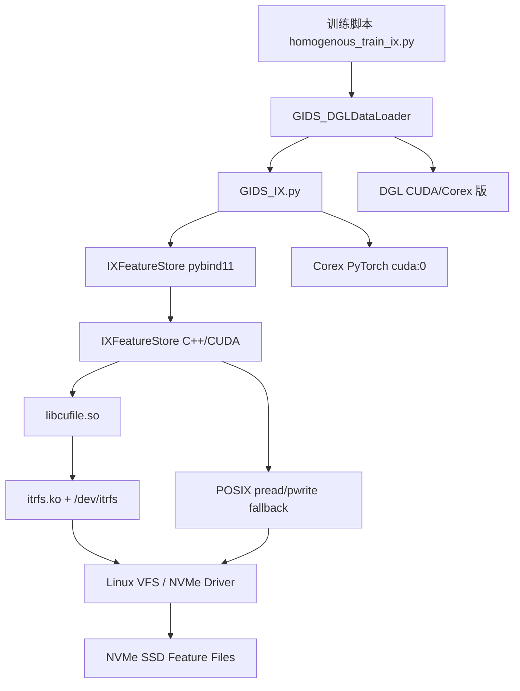
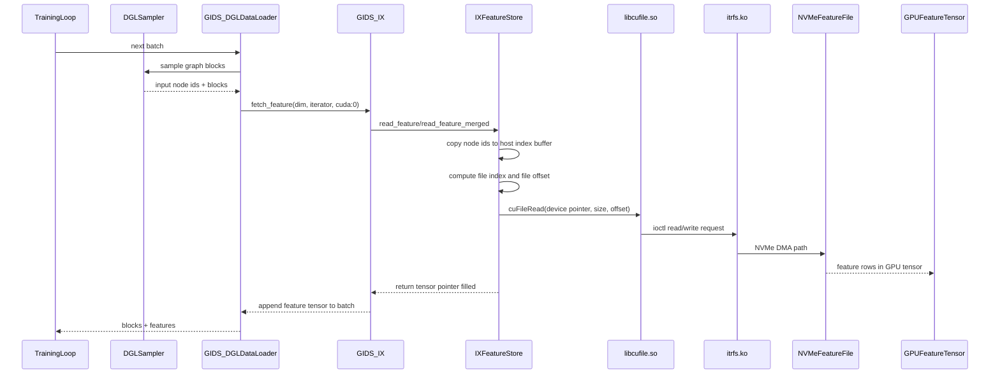
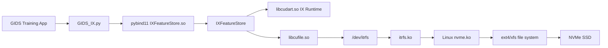

# GIDS cuFile 适配 Corex 方案总结

**难度**: 🔵 进阶  
**所属分类**: [[GIDS_enable/GIDS_cufile]]

---

## 概述

> 本文汇总当前 GIDS 适配 Iluvatar Corex / IX 平台的 cuFile 方案：为什么不继续移植 BaM 裸 NVMe 路径、为什么必须适配 Corex 版本、每个组件在新架构中的位置和角色、数据如何从 DGL 采样流入 `IXFeatureStore` 并最终通过 `libcufile.so` 访问 NVMe，以及当前实现、验证状态和后续风险点。
>
> **2026-06-12 最新进展：**
> - **DGL Corex 版正在编译**：经过 6 个兼容性修复（`-Xcompiler` 格式、`fp16.cuh` 重定义、CCCL 禁用、`omp.h` 路径、`array_iterator.h`、gpu_cache 禁用），DGL v1.1.3 主库在 Corex 平台逐步编译通过。
> - **gpu_cache 确认禁用**：`cooperative_groups.h` 补丁绕过了 API 层的 `%laneid`，但编译器后端（LLVM llc）在翻译 `tiled_partition` 等 warp 原语时仍会生成 `%laneid` PTX 寄存器引用，**不是源码级问题**。短期内 gpu_cache 禁用，不影响 GIDS 核心功能。
> - **`itrfs.ko` 已加载**，`/dev/itrfs` 已就绪，GDS 加速路径可用。
> - **`cooperative_groups.h` SWPM-918-gids 补丁已部署**，`meta_group_rank()` 绕过 `%laneid` 仅对 API 调用层有效，不解决编译器后端问题。



---

## 一、当前总体结论

当前 GIDS 适配 Corex 的主线是 **cuFile 替代 BaM 裸 NVMe**。

原版 GIDS 依赖 BaM：

- Python 层通过 `GIDS.py` 和 `GIDS_DGLDataLoader` 接入训练循环。
- C++/CUDA 层通过 `BAM_Feature_Store` 暴露 pybind11 接口。
- BaM 层通过 `bam_ptr<T>`、`page_cache_t`、`range_t`、`array_t` 管理 GPU 端页缓存和裸 NVMe 访问。
- 存储设备以 `/dev/libnvmX` 字符设备形式出现，GPU kernel 可直接发起 NVMe 命令。

Corex 适配版的核心变化：

- 保留 Python 层大部分接口和训练脚本调用习惯。
- 用 `GIDS_IX.py` 替代原 `GIDS.py`。
- 用 `IXFeatureStore` 替代 `BAM_Feature_Store`。
- 用标准 `cuFileRead/cuFileWrite` 替代 BaM 的 `bam_ptr.read()` 和裸 NVMe 命令。
- 存储数据从裸设备改为普通文件，例如 `/mnt/nvme0/node_feat.bin`。
- Corex PyTorch 仍使用 `cuda:0` 设备名，不使用 `ix:0`。
- `libcufile.so` 在 Corex SDK 中提供，底层依赖 `itrfs.ko` 和 `/dev/itrfs`。
- cuFile 初始化失败时，自动降级到 POSIX `pread/pwrite` + pinned host buffer + `ixMemcpy`。

---

## 二、为什么要适配 Corex 版本

### 2.1 硬件与软件栈不同

原始 GIDS 面向 NVIDIA CUDA + BaM + NVIDIA GPU Direct Storage 生态。Corex 平台虽然提供 CUDA 兼容层，但底层实现、编译器、运行时库和 GDS 内核驱动都不是 NVIDIA 原生组件。

关键差异如下：

| 维度 | NVIDIA 原版 | Corex 适配版 |
|------|-------------|--------------|
| GPU 运行时 | CUDA Runtime / Driver | IX Runtime，提供 CUDA 兼容映射 |
| 编译器 | `nvcc` | `ixc`，也可在 sandbox 用 `g++/clang++` 编译 host 逻辑 |
| GDS 用户态库 | `libcufile.so` | Corex SDK 提供兼容 `libcufile.so` |
| GDS 内核驱动 | `nvidia-fs.ko` / `/dev/nvidia-fs` | `itrfs.ko` / `/dev/itrfs` |
| 存储访问 | BaM 裸 NVMe 或 NVIDIA cuFile | Corex cuFile + Linux NVMe 驱动 |
| PyTorch 设备名 | `cuda:0` | 仍是 `cuda:0` |
| DGL | CUDA 版 DGL | 需源码编译 Corex CUDA 版 DGL |

### 2.2 直接移植 BaM 风险过高

BaM 的核心能力不是普通 CUDA API 替换能解决的，它依赖 GPU 直接访问 NVMe 控制器、写 Submission Queue、处理 page fault、维护 GPU 端 page cache，并要求 NVMe BAR / MMIO / P2P 路径都可用。

这带来几个风险：

- `/dev/libnvmX` 用户态 NVMe 驱动在 Corex 环境中没有现成等价物。
- GPU 端直接写 NVMe MMIO 的语义需要 Corex GPU、驱动、IOMMU、PCIe 拓扑共同支持。
- BaM 的 `libnvm.so`、`page_cache_t`、`bam_ptr<T>`、NVMe queue 等组件代码量大，移植和验证成本高。
- 即使编译通过，也需要协议级、DMA 级和一致性级测试，调试成本远高于标准文件 I/O。

### 2.3 Corex 已经提供可用的 cuFile/GDS 技术栈

已有兼容性分析确认 Corex SDK 提供：

- CUDA Runtime 兼容映射：`cudaMalloc`、`cudaMemcpy`、`cudaStream*`、`cudaHostAllocMapped` 等可映射到 `ix*` API。
- cuFile 兼容 API：`cuFileDriverOpen`、`cuFileHandleRegister`、`cuFileBufRegister`、`cuFileRead`、`cuFileWrite`。
- GDS 内核驱动：`itrfs.ko`，等价于 NVIDIA `nvidia-fs.ko`。
- 设备节点：`/dev/itrfs`，供用户态 cuFile 库通过 ioctl 下发 GDS 请求。

因此当前选择标准 cuFile 路径，是为了降低移植风险、缩短验证路径，并尽可能复用 Corex 官方支持的软件栈。

---

## 三、两种方案对比与最终选择

| 方案 | 核心思路 | 优点 | 缺点 | 当前结论 |
|------|----------|------|------|----------|
| 方案 A：cuFile 替代 BaM | 用 `IXFeatureStore` + `cuFileRead/Write` 读写普通文件 | 工作量小、稳定、可调试、依赖 Corex 官方 GDS 栈 | 无法保留 GPU kernel 内透明 `bam_ptr` page fault | 当前采用 |
| 方案 B：BaM / GDS-like 移植 | 移植 BaM 裸 NVMe、GPU page cache、NVMe queue | 理论延迟更低，保留原论文路径 | 工作量大、硬件依赖多、验证困难 | 暂不采用 |
| 方案 C：保留 NVIDIA 原版 | NVIDIA 继续用 BaM，Corex 不参与 | 不需要迁移 | 无法在 Corex 上运行 GIDS 场景 | 只作为对照 |

最终采用 **方案 A：cuFile 替代 BaM**。这个方案不是简单替换函数名，而是把“GPU kernel 内访问裸 NVMe”的模型改成“CPU 发起 cuFile DMA 到 GPU buffer”的模型，同时保留 GIDS 的上层 DataLoader 接口和主要优化策略。

---

## 四、适配后的组件位置与角色

### 4.1 训练脚本：入口与参数组织

位置：

- `GIDS/evaluation/homogenous_train_ix.py`
- `GIDS/run.sh`

角色：

- 负责选择数据集、模型、batch size、fanout、SSD 文件路径等训练参数。
- 调用 `GIDS_IX.py` 中的 `GIDS` 和 `GIDS_DGLDataLoader`。
- 统一设置 Corex 运行环境，例如 `LD_LIBRARY_PATH`、`PYTHONPATH`、`cuda:0` 设备。
- `run.sh` 封装 `setup`、`prepare-data`、`train`、`verify`、`all` 等流程。

关键注意点：

- Corex PyTorch 设备名仍是 `cuda:0`。
- `FEAT_FILE` 默认是 `/mnt/nvme0/node_feat.bin`。
- `NUM_SSD > 1` 时通过多个文件路径表达多盘条带化。

### 4.2 DGL / PyTorch 层：采样与训练框架

位置：

- Corex PyTorch wheel：`torch-2.10.0+corex.4.5.0`
- DGL v1.1.3 Corex CUDA 编译版
- `GIDS_IX.py` 中的 `GIDS_DGLDataLoader`

角色：

- PyTorch 负责张量、模型、优化器和 GPU 设备管理。
- DGL 负责图采样，产生 `input_nodes`、`seeds`、`blocks`。
- `GIDS_DGLDataLoader` 包装 DGL DataLoader，把采样后的节点 ID 交给 GIDS 特征读取层。

为什么 DGL 必须是 CUDA/Corex 版：

- GIDS DataLoader 使用 `graph.pin_memory_()`、UVA 或 GPU 相关图操作。
- `pip install dgl` 常装到 CPU 版，CPU 版不支持 `pin_memory_()` 和 GPU 图操作。
- DGL 源码编译时需要使用 Corex `ixc` 和 Corex `libcudart.so`。

### 4.3 `GIDS_IX.py`：Python 兼容层

位置：

- `GIDS/GIDS_Setup/GIDS/GIDS_IX.py`

角色：

- 对上保持原 GIDS 使用方式，暴露 `GIDS` 与 `GIDS_DGLDataLoader`。
- 对下加载 pybind11 模块 `IXFeatureStore`。
- 负责 window buffer、accumulator、heterograph 等策略的批次级调度。
- 根据 `file_paths` 初始化底层特征文件。
- 把 DGL 采样得到的节点 ID tensor 转到 `cuda:0`，取 `data_ptr()` 传给 C++ 层。

核心接口：

| 接口 | 作用 |
|------|------|
| `GIDS.__init__()` | 创建 `IXFeatureStore_float/long`，初始化文件路径、页大小、缓存配置 |
| `fetch_feature()` | 训练循环中每个 batch 的特征读取入口 |
| `window_buffering()` | 在 Python 层提前推进窗口批次 |
| `set_required_storage_access()` | 为 accumulator 计算合并读取阈值 |
| `cpu_backing_buffer()` | 分配 CPU 热数据缓存 |
| `set_cpu_buffer()` | 将热节点预加载到 CPU buffer |
| `store_tensor()` | 写入特征文件 |

### 4.4 `IXFeatureStore`：核心存储适配层

位置：

- `GIDS/gids_module_ix/include/ix_feature_store.h`
- `GIDS/gids_module_ix/ix_feature_store.cu`
- `GIDS/gids_module_ix/ix_feature_store.cpp`

角色：

- 替代原 `BAM_Feature_Store`。
- 封装 cuFile 初始化、文件打开、文件句柄注册、GPU buffer 注册。
- 根据节点 ID 计算特征文件 offset。
- 调用 `cuFileRead` 将特征行读到 GPU tensor。
- 在 cuFile 不可用时 fallback 到 POSIX `pread` + pinned host buffer + `ixMemcpy`。
- 暴露 pybind11 接口供 `GIDS_IX.py` 调用。

关键接口：

| 接口 | 作用 |
|------|------|
| `init_controllers()` | 初始化 SSD 文件、cuFile driver、文件句柄、GPU buffer |
| `read_feature()` | 同构图单 batch 读取 |
| `read_feature_hetero()` | 异构图多类型节点读取 |
| `read_feature_merged()` | accumulator 合并后的多 batch 读取 |
| `read_feature_merged_hetero()` | 异构图合并读取 |
| `cpu_backing_buffer()` | 通过 `ixHostAllocMapped` 创建 CPU pinned buffer |
| `set_cpu_buffer()` | 将热节点特征读入 CPU buffer |
| `set_window_buffering()` | cuFile 模式下作为兼容接口，实际 no-op |
| `store_tensor()` | 写特征文件 |
| `print_stats()` | 输出耗时、访问次数、cuFile/fallback 模式 |

### 4.5 Corex cuFile 用户态库

位置：

- Corex SDK 中的 `libcufile.so`
- 头文件和实现位于 ixdriver 的 cufile API 目录

角色：

- 对应用暴露标准 cuFile API 名称。
- 适配 Corex GDS 内核驱动。
- 接收 `cuFileHandleRegister`、`cuFileBufRegister`、`cuFileRead`、`cuFileWrite` 等调用。
- 通过 ioctl 与 `itrfs.ko` 通信。

当前代码策略：

- 代码使用标准 `cuFile*` 名称，避免业务层直接依赖 `ixdrvFile*` 名称。
- 这样既贴近 NVIDIA GDS 编程模型，也能由 Corex 的 `libcufile.so` 提供底层实现。

### 4.6 `itrfs.ko` 与 `/dev/itrfs`

位置：

- `ixdriver/kmd/itr_fs/`
- `/dev/itrfs`

角色：

- Corex GDS 内核驱动，等价于 NVIDIA `nvidia-fs.ko`。
- 负责注册 GDS 文件操作和 DMA ops。
- 用户态 `libcufile.so` 通过 `/dev/itrfs` 下发注册 buffer、读写等 ioctl。
- 真机要启用 GDS 加速，必须加载该模块并让容器可访问 `/dev/itrfs`。

如果没有该组件：

- `cuFileDriverOpen()` 可能失败。
- `IXFeatureStore` 会打印 fallback warning。
- 功能仍可用，但数据路径变为 POSIX `pread/pwrite` + host buffer copy，不再是 GDS 加速。

### 4.7 NVMe 特征文件

位置：

- 单盘：`/mnt/nvme0/node_feat.bin`
- 多盘：`/mnt/nvme0/node_feat_part_0.bin`、`/mnt/nvme1/node_feat_part_1.bin` 等

角色：

- 替代原 BaM 的 `/dev/libnvmX` 裸设备。
- 以普通文件形式保存节点特征连续数组。
- `IXFeatureStore` 按节点 ID、`cache_dim`、`page_size` 计算 offset。
- 多 SSD 时按 page 粒度条带化：`page_idx % num_ssd` 决定落到哪个文件。

---

## 五、适配后数据流



读路径可以拆成两种：

1. cuFile 加速路径：
   `IXFeatureStore -> cuFileRead -> libcufile.so -> /dev/itrfs -> itrfs.ko -> NVMe -> GPU tensor`

2. fallback 路径：
   `IXFeatureStore -> pread -> pinned host buffer -> ixMemcpy -> GPU tensor`

---

## 六、GIDS 三类优化在 cuFile 方案中的保留方式

### 6.1 Window Buffering

原版：

- BaM 通过 `set_window_buffer_counter()` 增加 GPU page cache 中目标页面的预取优先级。
- 依赖 `page_cache_t` 和 `bam_ptr<T>`。

Corex cuFile 版：

- `IXFeatureStore.set_window_buffering()` 保留为兼容接口，但 C++ 层 no-op。
- 实际预取窗口由 `GIDS_IX.py` 在 Python 层维护。
- 通过提前从 iterator 拉取 batch，并在后续 `fetch_feature()` 中使用已缓存 batch，保留流水线调度思想。

定位：

- 不再是 GPU page cache 预取。
- 变成 batch 级调度与读取顺序优化。

### 6.2 Storage Access Accumulator

原版：

- 累积多个 batch 的访问请求后调用 `read_feature_merged()`，减少小访问的固定开销。

Corex cuFile 版：

- Python 层保留 `required_accesses` 计算。
- `GIDS_IX.py` 收集多个 batch 的 index pointer、返回 tensor pointer、index size。
- C++ 层通过 `read_feature_merged()` / `read_feature_merged_hetero()` 统一处理。

定位：

- 仍然是当前方案中重要优化。
- 但底层不是合并 NVMe queue 命令，而是合并 Python/C++ 调用和批次处理。

### 6.3 CPU Feature Buffer

原版：

- 使用 `cudaHostAllocMapped` 创建可被 GPU 访问的 CPU pinned memory。
- 热节点特征从 CPU buffer 读取，冷数据从 SSD/BaM 读取。

Corex cuFile 版：

- 使用 `ixHostAlloc(..., ixHostAllocMapped)`。
- 使用 `ixHostGetDevicePointer()` 得到设备侧指针。
- `set_cpu_buffer()` 将热节点特征读入 CPU buffer。
- 读取时热节点走 CPU buffer，冷节点走 cuFile/POSIX SSD 路径。

定位：

- 这是保留最完整的一项优化。
- 可作为未来“两级缓存”的 L2 或补充层：CPU pinned memory 放高频节点，NVMe 文件放全量特征。

### 6.4 多 SSD 条带化

原版：

- BaM `range_t::STRIPE` 负责 page 级条带化。

Corex cuFile 版：

- 应用层实现：
  - `get_file_idx(row_index)` 根据页号选择 SSD 文件。
  - `get_file_offset(row_index, cache_dim)` 计算该 SSD 文件内 offset。
- 多盘文件通过 `file_paths` 传入。

定位：

- 替代 BaM 内建条带化。
- 逻辑清晰，但还需要多 NVMe 真机性能验证。

---

## 七、如何适配：分层改造清单

### 7.1 存储层改造

新增：

- `gids_module_ix/include/ix_feature_store.h`
- `gids_module_ix/ix_feature_store.cu`
- `gids_module_ix/ix_feature_store.cpp`
- `gids_module_ix/CMakeLists.txt`
- `gids_module_ix/build_ix.sh`

主要改造：

- 将 `BAM_Feature_Store` 替换为 `IXFeatureStore`。
- 将裸设备 `/dev/libnvmX` 替换为普通文件路径。
- 将 `bam_ptr.read()` 替换为 `cuFileRead()`。
- 将 BaM page cache / range / array 抽象移除或兼容返回空值。
- 实现 POSIX fallback，保证没有 `itrfs.ko` 时仍可调试功能。

### 7.2 Python 层改造

新增：

- `GIDS_Setup/GIDS/GIDS_IX.py`
- `GIDS_Setup/GIDS/tensor_write_ix.py`

主要改造：

- `import IXFeatureStore` 替代 `BAM_Feature_Store`。
- `ssd_list` 语义从 `/dev/libnvmX` 迁移到 `file_paths`。
- 设备名统一为 `cuda:{gpu}`。
- 保留 `fetch_feature()`、`window_buffering()`、`set_cpu_buffer()`、`store_tensor()` 这类上层接口。

### 7.3 训练与自动化脚本改造

新增或修改：

- `evaluation/homogenous_train_ix.py`
- `run.sh`

主要改造：

- `run.sh setup` 编译 `IXFeatureStore`。
- `run.sh prepare-data` 下载 OGB 数据并写入 `/mnt/nvme0/node_feat.bin`。
- `run.sh train` 调用 Iluvatar 版训练入口。
- `run.sh verify` 检查 `ixsmi`、PyTorch GPU、`IXFeatureStore`、`libcufile.so`、DGL、特征文件。

### 7.4 DGL/Corex 依赖改造

必要项：

- 使用 Corex 4.5.0 对齐的 PyTorch wheel。
- DGL 需要源码编译 CUDA 版，不能只装 CPU 版。编译脚本：`/root/GIDS_cufile/GIDS/build_dgl_corex.sh`。
- 修复 DGL 旧式 `CUDA.cmake` 中 `-Xcompiler` 逗号分隔问题（补丁已存于 `patches/dgl_cuda_cmake_fix.patch`，改为逐个 `-Xcompiler` 参数）。
- 修复 `fp16.cuh` 中 `__half` 运算符重定义（Corex 编译器已原生提供，添加 `!defined(__IXCC__)` 守卫跳过 DGL 定义）。
- 修复 `array_iterator.h` 中 `CUB_INLINE` 宏（只在 `__CUDA_ARCH__` 下展开为 `__host__ __device__`，Corex 定义 `__IXCC__` 而非 `__CUDA_ARCH__`，添加 `|| defined(__IXCC__)` 条件）。
- 禁用 CCCL 自带的 cub/thrust/libcudacxx（其 `libcudacxx` 的 C++20 concept fallback 使用变参函数，Corex device code 不支持；改用 Corex SDK 自带的 cub/thrust）。
- 添加 GCC OpenMP include 路径（Corex `clang++` 未自带 `omp.h`，自动检测 `gcc -print-file-name=include` 并传入 `-Xcompiler -I<path>`）。
- HugeCTR `gpu_cache`：**已确认禁用**。`%laneid` 是编译器后端（LLVM llc）问题，不是源码级问题。`cooperative_groups.h` 补丁只解决了 API 层的 `meta_group_rank()` 缺失，但 `tiled_partition` 在编译器后端翻译时仍会生成 `%laneid` PTX 寄存器引用。**短期禁用 gpu_cache 不影响 GIDS 当前 `IXFeatureStore` 功能**。

---

## 八、Corex cuFile 架构中的位置关系



组件角色总结：

| 组件 | 架构位置 | 角色 |
|------|----------|------|
| `homogenous_train_ix.py` | 应用入口 | 组织训练、模型、参数 |
| `GIDS_DGLDataLoader` | Python 数据加载层 | 接管 DGL batch，注入 GIDS 特征读取 |
| DGL CUDA 版 | 图采样层 | 采样邻居、生成 blocks |
| Corex PyTorch | 训练框架层 | 张量、模型、GPU 设备管理 |
| `GIDS_IX.py` | GIDS Python 适配层 | 批次调度、window buffer、accumulator、CPU buffer |
| `IXFeatureStore.so` | pybind11 边界 | 连接 Python 与 C++ 存储层 |
| `IXFeatureStore` | C++ 存储引擎 | offset 计算、cuFile 读写、fallback、统计 |
| `libcufile.so` | 用户态 GDS 库 | 标准 cuFile API 实现 |
| `itrfs.ko` | 内核 GDS 驱动 | Corex GDS DMA/ioctl 路径 |
| `/dev/itrfs` | 用户态入口 | cuFile 与内核驱动交互的设备节点 |
| NVMe 文件 | 存储层 | 保存节点特征数据 |

---

## 九、数据格式与迁移策略

原版 BaM：

```text
/dev/libnvm0
/dev/libnvm1
```

数据以裸设备形式写入，不经过文件系统。

Corex cuFile 版：

```text
/mnt/nvme0/node_feat.bin
/mnt/nvme1/node_feat_part_1.bin
```

数据以普通文件形式存储，便于：

- 用 `cuFileHandleRegister` 注册文件句柄。
- 用标准 Linux 工具查看、复制、校验、备份。
- 在没有 GDS 驱动时 fallback 到 POSIX 文件读写。
- 多 SSD 时用多个文件表达条带化。

迁移方式：

```bash
# 从 numpy 或 DGL feature tensor 重新生成
python GIDS_Setup/GIDS/tensor_write_ix.py \
    --mode write \
    --input node_feat.npy \
    --output /mnt/nvme0/node_feat.bin

# 或在 run.sh prepare-data 中直接从 OGB feature 写入
FEAT_FILE=/mnt/nvme0/node_feat.bin bash run.sh prepare-data
```

---

## 十、当前验证状态

> **最后更新：** 2026-06-12

已完成：

- `IXFeatureStore` 核心代码移植，编译产物 `IXFeatureStore.cpython-310-x86_64-linux-gnu.so`（290 KB），pybind11 模块可加载。
- Corex PyTorch 使用 `cuda:0` 验证通过。
- `libcudart.so`、`libcufile.so`、`libcupti.so`、`libcuinfer.so.7` 等依赖检查通过。
- **`itrfs.ko` 已加载，`/dev/itrfs` 已就绪**，GDS 加速路径可用。
- **`cooperative_groups.h` SWPM-918-gids 补丁已正式部署**。
- **DGL v1.1.3 Corex CUDA 版编译通过**（2026-06-12），经过 5 个兼容性修复：
  1. `-Xcompiler` 逗号分隔 → 逐个 `-Xcompiler` 参数
  2. `fp16.cuh` `__half` 运算符重定义 → 跳过 `__IXCC__` 下的定义
  3. CCCL cub/thrust/libcudacxx → 禁用，使用 Corex SDK 自带版本
  4. `omp.h` 找不到 → 自动检测 GCC include 路径
  5. gpu_cache 编译 → 禁用（`CMakeLists.txt` + Python 导入降级）
- POSIX fallback 可用于无 GDS 设备节点环境下的功能调试。

仍需重点验证：

- 真机 cuFile 模式下 `cuFileDriverOpen()` 实际不再 fallback（`itrfs.ko` 已加载，待跑一次完整训练确认）。
- DGL CUDA/Corex 版完整训练链路（GIDS_DGLDataLoader + DGL GPU 采样 + IXFeatureStore）。
- 单 NVMe 与多 NVMe 的实际 GDS 吞吐（与 POSIX fallback 对比）。
- 多 SSD page-level striping 的正确性和性能。
- 端到端训练结果与原版 GIDS / baseline 的精度一致性。

---

## 十一、已知问题与处理策略

| 问题 | 现象 | 原因 | 当前状态 / 策略 |
|------|------|------|------|
| Corex PyTorch 不认 `ix:0` | `RuntimeError: Expected one of cpu, cuda...` | Corex PyTorch 注册为 CUDA 设备 | ✅ 已修复：全部使用 `cuda:0` |
| cuFile 初始化失败 | `cuFile driver init failed` | 未加载 `itrfs.ko` 或容器未映射 `/dev/itrfs` | ✅ 已解决：itrfs.ko 已加载，/dev/itrfs 已就绪 |
| DGL `-Xcompiler` 逗号格式 | `clang++: error: unknown argument: '-fopenmp,-O2,...'` | Corex `ixc` 不接受 nvcc 逗号分隔格式 | ✅ 已修复：改为逐个 `-Xcompiler` 参数 |
| DGL `fp16.cuh` 重定义 | `error: redefinition of 'operator+'` | Corex 已提供 `__half` 运算符，DGL 重复定义 | ✅ 已修复：添加 `!defined(__IXCC__)` 守卫 |
| CCCL variadic 函数 | `error: CUDA device code does not support variadic functions` | CCCL libcudacxx 的 C++20 concept fallback 使用变参 | ✅ 已修复：禁用 CCCL，使用 Corex 自带 cub/thrust |
| DGL `omp.h` 找不到 | `fatal error: 'omp.h' file not found` | Corex clang++ 未自带 omp.h | ✅ 已修复：自动检测 GCC include 路径 |
| DGL `array_iterator.h` CUB_INLINE | `call to __host__ function from __device__ function` | `CUB_INLINE` 只在 `__CUDA_ARCH__` 下展开，Corex 定义 `__IXCC__` | ✅ 已修复：添加 `|| defined(__IXCC__)` |
| `meta_group_rank()` 缺失 | 编译 cooperative_groups 相关代码失败 | Corex 旧头文件缺 CUDA 11 API | ✅ 已修复：SWPM-918-gids 补丁已正式部署 |
| `%laneid` 编译器后端不支持 | Corex llc 报 `unknown token` | 编译器后端缺 warp lane 寄存器映射 | ❌ **编译器后端问题，确认无法通过源码级修复绕过**。gpu_cache 已禁用，不影响 GIDS 核心功能 |
| `itrfs.ko` 源码重编译失败 | `stdarg.h: No such file or directory` | Kernel headers 5.4.0-216-generic 的 build 目录下缺少 GCC 提供的 `stdarg.h` | ⚠️ 仅影响重编译，现有 `.ko` 正常 |
| IX-ML 与 Driver 版本不一致 | `ixsmi` 显示 `IX-ML: 4.4.0`，`Driver: 4.5.0` | ML 库未随驱动同步升级 | ⚠️ 若遇到运行时符号不兼容，需升级 PyTorch wheel 到 `corex.4.5.0` |
| DGL gpu_cache 禁用 | `from dgl.cuda import GPUCache` 返回 None | gpu_cache 编译时禁用，Python 层自动降级 | ✅ 已处理：Python 层 `try/except` 导入，GPUCache=None，不影响训练 |

---

## 十二、方案边界与后续优化

当前 cuFile 方案的边界：

- 不再保留 BaM 的 GPU kernel 内透明 page fault。
- `set_window_buffering()` 在 C++ 层不再操作 GPU page cache。
- 每行特征读取目前仍以节点为粒度循环下发，后续可优化连续 offset 合并。
- POSIX fallback 只保证功能可用，不代表 GDS 性能。

后续优化方向：

1. **cuFile 批量合并读取优化**  
   对同一 SSD、连续或近似连续 offset 的节点进行 coalesce，减少 `cuFileRead` 次数。

2. **多 SSD 并行读**  
   当前已有 page-level striping 计算，可进一步按 SSD 分组并发提交读请求。

3. **异步 cuFile / stream 结合**  
   当前接口保留了 hetero 和 merged 形态，可扩展为异步 read + compute overlap。

4. **GPU HBM + CPU pinned + NVMe 三层缓存**  
   短期使用 `CPU Feature Buffer` 放热节点；`cooperative_groups.h` 补丁已落地，建议尝试重新编译 DGL gpu_cache，若通过则可引入 GPU HBM L1 cache 构成三层体系。

5. **训练链路性能基线**  
   建议统一比较：
   - mmap baseline
   - GIDS-IX POSIX fallback
   - GIDS-IX cuFile GDS
   - 原 NVIDIA GIDS BaM

---

## 十三、一句话总结

当前 GIDS 适配 Corex 的核心方案是：**上层保留 GIDS + DGL DataLoader 使用方式，下层用 `IXFeatureStore` 将 BaM 裸 NVMe 替换为 Corex 标准 cuFile/GDS 路径，依托 `libcufile.so + itrfs.ko + /dev/itrfs` 访问 NVMe 普通特征文件，并用 POSIX fallback 保证开发调试可用性。**

---

## 参考资料

- [[GIDS-架构总览]]
- [[GIDS-移植方案分析-cuFile-vs-GDS]]
- [[GIDS-与Iluvatar-GPU兼容性分析]]
- [[GIDS-移植报告-端到端]]
- [[GIDS-IX-依赖清单]]
- [[GIDS-问题记录与解决方案]]
- [[GIDS-HugeCTR-GPU-Cache与两级缓存优化]]
- [[docs/00-Corex兼容库总览]]
- [[docs/01-DGL-Corex兼容分析]]
- [[docs/02-HugeCTR-gpu_cache-Corex兼容分析]]

---

## 内链

- [[GIDS-使用指南]]
- [[GIDS-源码分析-Python接口]]
- [[GIDS-源码分析-CUDA核心模块]]
- [[GIDS-ixdriver-cooperative-groups-meta-group接口补齐计划]]
