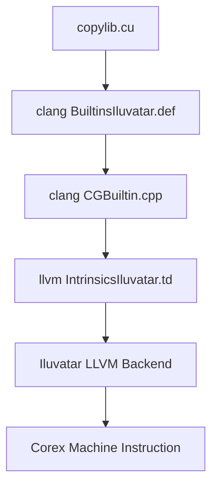

# Corex `__ivcorex` 内建指令与 `copylib.cu` 用法分析

> **分析对象：** `/home/corex/sw_home_1/sw_home/sdk/ixdriver/umd/kernels/copylib.cu`  
> **编译器线索：** `/home/corex/sw_home_1/sw_home/sdk/ixcc`  
> **核心定义：** `BuiltinsIluvatar.def`、`IntrinsicsIluvatar.td`、`CGBuiltin.cpp`、`__clang_cuda_ivcorex_intrinsics.h`  
> **整理日期：** 2026-06-11

---

## 1. 总览

`copylib.cu` 中出现的 `__ivcorex_*` 不是普通 C/C++ 函数，而是 Corex/Iluvatar 后端暴露给 CUDA device code 的编译器 builtin。它们在 Clang 前端被识别，在 CodeGen 阶段 lowered 到 `llvm.bi.*` intrinsic，最后由 Iluvatar LLVM 后端选择真实机器指令。



`copylib.cu` 实际使用的指令族很集中：

| 指令族 | 示例 | 作用 |
|--------|------|------|
| `__ivcorex_ml_mem_load_*` | `__ivcorex_ml_mem_load_i32` | 使用 `v4u32` 描述符，从 global/private memory 读取标量或向量 |
| `__ivcorex_ml_mem_store_*` | `__ivcorex_ml_mem_store_i8` | 使用 `v4u32` 描述符，向 global/private memory 写入标量或向量 |
| `__ivcorex_ml_mem_a64_load_*` | `__ivcorex_ml_mem_a64_load_i16` | 使用普通 64-bit 指针直接从 global memory 读取 |
| `__ivcorex_ml_mem_a64_store_*` | `__ivcorex_ml_mem_a64_store_i8` | 使用普通 64-bit 指针直接向 global memory 写入 |
| `__ivcorex_lane_id` | `__ivcorex_lane_id()` | 读取当前线程在 wave/warp 内的 lane ID |
| `__ivcorex_readlane` | `__ivcorex_readlane(x, 0)` | 从指定 lane 广播一个标量值到当前 lane |

---

## 2. `copylib.cu` 中每类指令的含义

### 2.1 描述符版内存读：`__ivcorex_ml_mem_load_i8/i16/i32`

调用形态：

```cpp
T value = __ivcorex_ml_mem_load_iXX(base_addr, voffset, soffset, kop);
```

在 `BuiltinsIluvatar.def` 中，这类指令的语义是 **Multilane load instruction**。有效地址计算为：

```text
address = base_addr + voffset + soffset
```

参数含义：

| 参数 | 含义 |
|------|------|
| `base_addr` | `v4u32` 地址描述符，`[0]` 是低 32 位地址，`[1]` 是高 32 位地址，`[2]`、`[3]` 通常填 `-1u` 作为默认地址属性 |
| `voffset` | 多 lane 偏移，通常让不同 lane/thread 访问不同元素 |
| `soffset` | 单 lane 统一偏移，常用于整组线程的基础跨度 |
| `kop` | cache policy，`0` 命中 L1/L2，`1` bypass L1，`2` bypass L2，`3` bypass L1/L2 |

`copylib.cu` 中的典型用法：

```cpp
int v = __ivcorex_ml_mem_load_i32(pSrc, i * 4, 0, 3);
```

这里 `pSrc` 保存源指针，`i * 4` 是每个线程负责的字节偏移，`kop=3` 表示绕过 L1 和 L2，更像一次流式 copy，不希望污染 cache。

### 2.2 描述符版内存写：`__ivcorex_ml_mem_store_i8/i16/i32`

调用形态：

```cpp
__ivcorex_ml_mem_store_iXX(value, base_addr, voffset, soffset, kop);
```

语义是 **Multilane store instruction**，地址计算仍是：

```text
address = base_addr + voffset + soffset
```

`copylib.cu` 用它实现 1/2/4 字节写入，以及 3 字节尾部的拆分写入：

```cpp
short s = __ivcorex_ml_mem_load_i16(pSrc, i * 4, 0, 3);
__ivcorex_ml_mem_store_i16(s, pDst, i * 4, 0, 1);
char c = __ivcorex_ml_mem_load_i8(pSrc, i * 4 + 2, 0, 3);
__ivcorex_ml_mem_store_i8(c, pDst, i * 4 + 2, 0, 1);
```

这里源读 `kop=3`，目的写 `kop=1`。从注释定义看，`kop=1` 是 bypass L1、保留 L2 行为；copy 场景下这通常用于降低 L1 cache 污染。

### 2.3 A64 版内存读写：`__ivcorex_ml_mem_a64_load/store_*`

调用形态：

```cpp
T value = __ivcorex_ml_mem_a64_load_iXX(ptr, kop);
__ivcorex_ml_mem_a64_store_iXX(value, ptr, kop);
```

A64 版不需要手工构造 `v4u32` 描述符，直接传普通 C/C++ 指针。Clang CodeGen 会把指针转换到 global address space，并生成 `llvm.bi.load.kop` 或 `llvm.bi.store.kop`：

| builtin | CodeGen 目标 |
|---------|--------------|
| `__ivcorex_ml_mem_a64_load_*` | `Intrinsic::bi_load_kop` |
| `__ivcorex_ml_mem_a64_store_*` | `Intrinsic::bi_store_kop` |

`KernelCopy2` 用 A64 版处理尾部 1/2/3 字节：

```cpp
char v = __ivcorex_ml_mem_a64_load_i8((char*)(src + size_dw), 0);
__ivcorex_ml_mem_a64_store_i8(v, (char*)(dst + size_dw), 0);
```

这个分支只由全局第 0 个线程执行，因此不需要再构造 per-lane 描述符和 offset。

### 2.4 `__ivcorex_lane_id`

调用形态：

```cpp
unsigned lane_id = __ivcorex_lane_id();
```

含义是读取当前线程在 wave/warp 内的 lane ID。`BuiltinsIluvatar.def` 给出的说明是 “Read the lane ID”，`CGBuiltin.cpp` 将其 lowered 到 `Intrinsic::bi_lane_id`，并标注范围为 `0..64`。

`KernelCopy2` 用它让一个 warp 内每个 lane 访问连续的 4 字节元素：

```cpp
data[i] = __ivcorex_ml_mem_load_i32(SBase, lane_id * 4, s_offset, 0);
```

### 2.5 `__ivcorex_readlane`

调用形态：

```cpp
int y = __ivcorex_readlane(x, lane_index);
```

含义是读取指定 lane 上的 `x` 值，并把该值返回给当前 lane。LLVM intrinsic 注释里有一个重要约束：lane 参数必须在当前 active wave 内保持 uniform，否则结果未定义。

`KernelCopy2` 的用法：

```cpp
unsigned warp_id = __ivcorex_readlane(threadIdx.x / warpSize, 0);
```

`threadIdx.x / warpSize` 对同一 warp 内所有 lane 本来就是相同值，这里再用 `readlane(..., 0)` 广播 lane 0 的结果，保证后续 `g_warp_id` 是 warp 级一致值。

---

## 3. `copylib.cu` 的实现意图

### 3.1 `KernelCopy`

`KernelCopy` 是最直接的 1D byte copy：

1. 用 `Dst` 和 `Src` 构造 `v4u` 地址描述符。
2. 每个线程按 `i = blockDim.x * blockIdx.x + threadIdx.x` 拷贝一个 `int`，即 4 字节。
3. 如果 `size_bytes` 不是 4 的整数倍，由 `i == size_dw` 的线程处理尾部 1/2/3 字节。

特点是逻辑简单，但每个线程只处理一个 4B 元素，吞吐取决于启动配置。

### 3.2 `KernelCopy2`

`KernelCopy2` 是 warp 协作版 copy：

1. 用 `lane_id` 作为 warp 内连续偏移。
2. 用 `g_warp_id` 计算当前 warp 的全局工作编号。
3. 每个线程循环处理 `item_per_thread = 4` 个元素。
4. 每轮跨距是 `warp_count * warpSize * sizeof(int)`，让所有 warp 交错覆盖整个 buffer。
5. 尾部不足 4 字节时，由全局第 0 个线程用 A64 指令处理。

这种写法比 `KernelCopy` 更像带 grid-stride 的 copy kernel，理论上能提高单次 launch 覆盖长度。

### 3.3 `KernelCopy2D`

`KernelCopy2D` 对每一行单独构造 `src_row` 和 `dst_row` 描述符：

```text
src_row = Src + y * spitch
dst_row = Dst + y * dpitch
```

然后对 `width_bytes` 做一行内的 4B copy 和尾部 byte copy。它的行为等价于按 pitch 执行二维内存拷贝。

### 3.4 `KernelFill1/2/4`

这三个 kernel 分别面向 1/2/4 字节粒度的 memset/fill。共同模式是：

1. 构造目的地址描述符。
2. 如果 `Dst` 不是 4 字节对齐，先用 1B/2B store 补齐到 4 字节边界。
3. 主循环每个线程最多写 4 次 32-bit store。
4. 末尾不足完整 store 时用 i8/i16 处理。

需要注意的可疑点：

| 位置 | 可疑点 | 影响 |
|------|--------|------|
| `KernelFill2` | 计算了 `const unsigned ui = value | (value << 16)`，但实际 store 使用的是 `value` 而不是 `ui` | 16-bit fill 用 32-bit store 时可能只重复低 16 位不正确 |
| `KernelFill2` | `if (i < elementSize)` 与前面的 `size_dw = elementSize / sizeof(short)` 语义不一致 | 如果 `elementSize` 表示字节数，边界判断可能过宽 |
| `KernelFill1/2/4` | 对齐补写后只移动了 `pDst[0] += complement`，但没有同步缩减后续长度或调整 `i` 的逻辑 | 非 4 字节对齐地址可能存在覆盖/越界风险，需要结合调用方参数验证 |

---

## 4. ixcc 中找到的同族内存指令

### 4.1 描述符版 `ml_mem`

这些指令都使用 `v4u32 base_addr + voffset + soffset + kop`：

| 分类 | 完整列表 |
|------|----------|
| load | `__ivcorex_ml_mem_load_i8`, `__ivcorex_ml_mem_load_i16`, `__ivcorex_ml_mem_load_f32`, `__ivcorex_ml_mem_load_i32`, `__ivcorex_ml_mem_load_i64`, `__ivcorex_ml_mem_load_i32x4` |
| store | `__ivcorex_ml_mem_store_i8`, `__ivcorex_ml_mem_store_i16`, `__ivcorex_ml_mem_store_f32`, `__ivcorex_ml_mem_store_i32`, `__ivcorex_ml_mem_store_i64`, `__ivcorex_ml_mem_store_i32x4` |
| predicated store | `__ivcorex_ml_mem_store_pred_i8`, `__ivcorex_ml_mem_store_pred_i16`, `__ivcorex_ml_mem_store_pred_i32`, `__ivcorex_ml_mem_store_pred_i64`, `__ivcorex_ml_mem_store_pred_i32x4` |

CodeGen 映射：

| 分类 | Lowering |
|------|----------|
| `ml_mem_load_*` | `MakeLdVs(Intrinsic::bi_ldp_vs)` |
| `ml_mem_store_*` | `MakeStVs(Intrinsic::bi_stp_vs, false)` |
| `ml_mem_store_pred_*` | `MakeStVs(Intrinsic::bi_stp_vs_pred, true)` |

### 4.2 A64 版 `ml_mem_a64`

A64 版使用普通地址指针和 `kop`，不使用 `v4u32` 描述符：

| 分类 | 数据类型后缀 |
|------|--------------|
| scalar load | `i8`, `i16`, `i32`, `i64`, `u8`, `u16`, `u32`, `u64`, `f32` |
| vector load | `i8x2`, `i8x4`, `i16x2`, `i16x4`, `i32x2`, `i32x4`, `i64x2`, `u8x2`, `u8x4`, `u16x2`, `u16x4`, `u32x2`, `u32x4`, `u64x2`, `f32x2`, `f32x4` |
| scalar store | `i8`, `i16`, `i32`, `i64`, `u8`, `u16`, `u32`, `u64`, `f32` |
| vector store | `i8x2`, `i8x4`, `i16x2`, `i16x4`, `i32x2`, `i32x4`, `i64x2`, `u8x2`, `u8x4`, `u16x2`, `u16x4`, `u32x2`, `u32x4`, `u64x2`, `f32x2`, `f32x4` |

完整命名规则：

```text
__ivcorex_ml_mem_a64_load_<type>(addr, kop)
__ivcorex_ml_mem_a64_store_<type>(data, addr, kop)
```

其中 `<type>` 可取上表中的所有后缀。

### 4.3 `kop` cache policy

`ml_mem` 和 `ml_mem_a64` 都使用相同 `kop` 语义：

| `kop` | 含义 |
|-------|------|
| `0` | L1 and L2 hit |
| `1` | bypass L1 |
| `2` | bypass L2 |
| `3` | bypass L1 and L2 |

`copylib.cu` 中的经验用法：

| 场景 | `kop` | 解释 |
|------|-------|------|
| 源数据 copy 读取 | `3` | 流式读，不污染 L1/L2 |
| 目的数据 copy 写入 | `1` | 绕过 L1，降低写入对 L1 的影响 |
| `KernelCopy2` 主体读写 | `0` | 使用默认 L1/L2 行为 |
| 尾部 A64 byte copy | `0` | 单线程少量尾部处理，使用默认 cache 行为 |

---

## 5. ixcc 中相关 `__ivcorex` 指令族全景

`BuiltinsIluvatar.def` 中存在大量 `__ivcorex_*` builtin，数量达到数百个。下面按功能域整理，便于查找和移植时定位。

| 功能域 | 代表指令 | 作用 |
|--------|----------|------|
| ABI/线程索引 | `__ivcorex_workgroup_id_x/y/z`, `__ivcorex_workitem_id_x/y/z`, `__ivcorex_kernarg_segment_ptr`, `__ivcorex_lane_id` | 读取 grid/block/thread/lane 相关隐式状态 |
| 系统寄存器与等待 | `__ivcorex_sl_getreg`, `__ivcorex_sl_setreg`, `__ivcorex_sl_getpc`, `__ivcorex_sl_waitcnt`, `__ivcorex_sl_wait_commit_record`, `__ivcorex_sl_wait_commit_waitcnt` | 读写硬件寄存器、读取 PC、等待 memory/async copy/mbarrier 计数 |
| CTA/cluster/pipe barrier | `__ivcorex_sl_barrier`, `__ivcorex_sch_barrier`, `__ivcorex_pipebar_req`, `__ivcorex_pipebar_wait`, `__ivcorex_nbarrier_*`, `__ivcorex_cluster_barrier_wait` | block、cluster 或 pipeline 级同步 |
| Warp/lane 通信 | `__ivcorex_readlane`, `__ivcorex_readfirstlane`, `__ivcorex_readlanef`, `__ivcorex_slb_shfl_idx_*`, `__ivcorex_shuffle` | lane 间数据广播、shuffle 和重排 |
| Vote/active mask | `__ivcorex_vote_any`, `__ivcorex_vote_all`, `__ivcorex_vote_ballot`, `__ivcorex_vote_*_sync`, `__ivcorex_activemask` | warp 内谓词归约、ballot、active mask |
| 普通 global/private memory | `__ivcorex_ml_mem_*`, `__ivcorex_ml_mem_a64_*`, `__ivcorex_ldg_burst_*` | 显式 load/store、cache policy 控制、burst load |
| Shared/SLB/SME memory | `__ivcorex_slb_liteload`, `__ivcorex_slb_litestore`, `__ivcorex_slb_sfaload*`, `__ivcorex_sme_*`, `__ivcorex_cp_async_*` | shared/local buffer、SME 异步 copy、shared/global 数据搬运 |
| Memory barrier | `__ivcorex_mbarrier_init_shared`, `__ivcorex_mbarrier_arrive_shared`, `__ivcorex_mbarrier_test_wait_shared` | shared memory barrier 初始化、到达、等待 |
| 数学函数 | `__ivcorex_rcp`, `__ivcorex_rcpf`, `__ivcorex_rsq`, `__ivcorex_rsqf`, `__ivcorex_sinf`, `__ivcorex_cosf`, `__ivcorex_fract*` | 倒数、倒数平方根、三角、取小数部分 |
| 类型转换 | `__ivcorex_cvt_*`, `__ivcorex_float2half_*`, `__ivcorex_short2half_*`, `__ivcorex_bfloat2half`, `__ivcorex_half2bfloat`, `__ivcorex_f32_to_e4m3/e5m2` | FP16/BF16/FP8/subbyte/整数转换 |
| 向量整数运算 | `__ivcorex_vaddus2`, `__ivcorex_vaddss2`, `__ivcorex_vaddus4`, `__ivcorex_vsub*`, `__ivcorex_funnelshift_*` | packed int8/int16 加减、饱和运算、位拼接移位 |
| Dot/MMA | `__ivcorex_fdot2`, `__ivcorex_idot2`, `__ivcorex_udot2`, `__ivcorex_bfdot2`, `__ivcorex_idot4`, `__ivcorex_udot4`, `__ivcorex_matrix_mad_*` | dot product、matrix multiply accumulate、FP16/BF16/TF32/FP8/I8 MMA |
| Atomic | `__ivcorex_atomic_*` | 原子加、比较、交换等后端支持的 global/shared 原子操作 |
| Cache/LSU 控制 | `__ivcorex_wbinvl1`, `__ivcorex_prevent_lsu_congestion` | L1 cache 写回失效、LSU 拥塞规避 |
| Grid dependency | `__ivcorex_griddepcontrol_launch_dependents`, `__ivcorex_griddepcontrol_wait` | kernel/grid 依赖控制 |

---

## 6. 使用建议

### 6.1 什么时候用描述符版 `ml_mem`

适合场景：

- 内核已经按 lane/thread 计算 `voffset`。
- 希望复用同一个 `base_addr` 描述符，减少普通指针转换。
- 需要显式区分 `voffset` 和 `soffset`，例如 warp 协作 copy、tile copy。

基本模板：

```cpp
typedef unsigned v4u __attribute__((ext_vector_type(4)));

v4u desc;
desc[0] = (unsigned)((uint64_t)ptr & 0xffffffff);
desc[1] = (unsigned)((uint64_t)ptr >> 32);
desc[2] = -1u;
desc[3] = -1u;

int value = __ivcorex_ml_mem_load_i32(desc, lane_offset, group_offset, kop);
__ivcorex_ml_mem_store_i32(value, desc, lane_offset, group_offset, kop);
```

### 6.2 什么时候用 A64 版 `ml_mem_a64`

适合场景：

- 只处理少量尾部数据。
- 不需要手工拆 base/offset。
- 使用普通 C/C++ 指针表达更清楚。

基本模板：

```cpp
char v = __ivcorex_ml_mem_a64_load_i8(ptr, kop);
__ivcorex_ml_mem_a64_store_i8(v, dst, kop);
```

### 6.3 什么时候用 `readlane/lane_id`

适合场景：

- 需要 warp 内某个 lane 的值广播给其他 lane。
- 需要 warp 内连续 lane 编号来构造 coalesced load/store。
- 实现 `__shfl*`、warp reduce、warp-level copy 的底层逻辑。

注意事项：

- `__ivcorex_readlane(data, index)` 的 `index` 应该在 active wave 内 uniform。
- `__ivcorex_lane_id()` 的范围在 CodeGen 中按 `0..64` 标注，不应硬编码 NVIDIA 32 lane 假设，除非调用方明确使用 `warpSize`。
- 如果是 cooperative_groups 适配，应优先用已有 CUDA wrapper；只有 wrapper 缺失或生成错误时再直接用 Corex builtin。

---

## 7. 与 GIDS 适配的关系

GIDS 当前主要关注 cuFile/GDS、DGL gpu_cache 和 cooperative_groups 兼容。`copylib.cu` 的 `__ivcorex_*` 指令说明了 Corex SDK 已经有一套底层 CUDA device builtin，可以直接表达：

- lane ID 与 lane 间广播；
- warp/CTA 级同步；
- 显式 cache policy 的 global memory load/store；
- 异步 copy 与 mbarrier；
- MMA/dot 等深度学习计算指令。

这对 GIDS 的启发是：如果上层 CUDA API 或 cooperative_groups 封装在 Corex 上缺项，可以优先在 `ixcc/clang/lib/Headers` 中找是否已有 `__ivcorex_*` 原语，再决定是补 CUDA 兼容头文件，还是修改 LLVM backend 的 PTX lowering。

当前 `copylib.cu` 最值得复用的模式是：

| 场景 | 可复用模式 |
|------|------------|
| GPU 端大块 copy | `KernelCopy2` 的 warp-stride + `lane_id` + `ml_mem_load/store_i32` |
| 非 4B 对齐尾部 | `i16 + i8` 拆分处理 |
| cache pollution 控制 | copy 读侧使用 `kop=3`，写侧使用 `kop=1` |
| 普通指针少量访问 | A64 版 `ml_mem_a64_*` |

---

## 8. 参考文件

- `/home/corex/sw_home_1/sw_home/sdk/ixdriver/umd/kernels/copylib.cu`
- `/home/corex/sw_home_1/sw_home/sdk/ixcc/clang/include/clang/Basic/BuiltinsIluvatar.def`
- `/home/corex/sw_home_1/sw_home/sdk/ixcc/llvm/include/llvm/IR/IntrinsicsIluvatar.td`
- `/home/corex/sw_home_1/sw_home/sdk/ixcc/clang/lib/CodeGen/CGBuiltin.cpp`
- `/home/corex/sw_home_1/sw_home/sdk/ixcc/clang/lib/Headers/__clang_cuda_ivcorex_intrinsics.h`
- `/home/corex/sw_home_1/sw_home/sdk/ixcc/clang/test/CodeGen/Iluvatar/builtin/common.cu`

